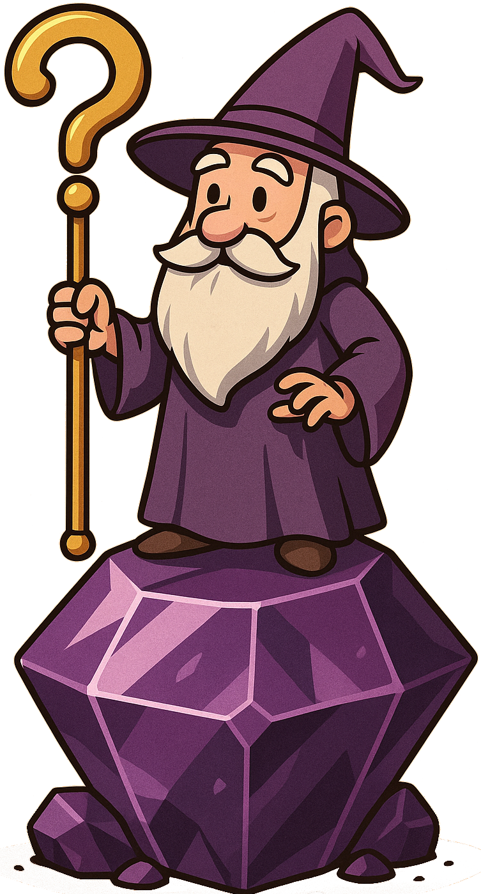

<div align="center">
  
</div>

# Quizium - Obsidian Plugin

A powerful flashcard and quiz plugin for Obsidian that transforms your notes into an interactive learning experience. Study your knowledge through spaced repetition, difficulty-based flashcards, and comprehensive quizzes.

## ✨ Features

### 📚 Flashcards with Smart Classification
- **Difficulty Rating System**: Rate flashcards as Easy, Moderate, or Challenging
- **Automatic Tracking**: Your ratings are saved and used to optimize future study sessions
- **Topic Organization**: Study by specific topics or review all flashcards together
- **Hint Support**: Add optional hints to help guide your thinking

### 🧠 Spaced Repetition
- **Intelligent Scheduling**: Cards reappear based on their difficulty rating and time intervals
- **Customizable Intervals**: Configure how often Easy, Moderate, and Challenging cards appear
- **Progress Tracking**: See statistics on your spaced repetition progress across all topics
- **Adaptive Learning**: Focus on cards that need the most attention

### 🎯 Interactive Quizzes
- **Multiple Choice Format**: Test your knowledge with 4-option quizzes
- **Immediate Feedback**: See correct answers and track your performance
- **Quiz History**: Review your past quiz results and track improvement over time
- **Topic-Based Quizzes**: Focus on specific subjects or test across all topics

### 💎 Learning Streaks
- **Daily Motivation**: Track consecutive days of study activity
- **Automatic Tracking**: Streaks update when you complete quizzes or rate flashcards
- **Highest Record**: Keep track of your longest learning streak ever achieved
- **Visual Display**: See your current streak and personal best on the main screen

## 📝 How to Format Questions

Quizium automatically detects questions in your notes when they're tagged with monitored hashtags. Here's how to format different types of questions:

### Basic Flashcard

```
[Q]What is the capital of France?
[A]Paris
```

### Flashcard with Hint

```
[Q]What is the largest planet in our solar system?
[A]Jupiter
[H]Think about the planet with the famous red spot
```

### Basic Quiz Question

```
[Q]What is the speed of light in a vacuum?
[A]299,792,458 meters per second
[B]Bad Response 1
[B]Bad Response 2
[B]Bad Response 3
```

### Quiz Question with Hint

```
[Q]Who wrote the novel "1984"?
[A]George Orwell
[B]Bad Response 1
[B]Bad Response 2
[B]Bad Response 3
[H]This author also wrote "Animal Farm"
```

## 🎮 How It Works

1. **Add Questions to Your Notes**: Use the format above in any note tagged with your monitored hashtags
2. **Open Quizium**: Use the command palette or ribbon icon to launch the plugin
3. **Choose Your Study Mode**:
   - **Flashcards**: Study with immediate feedback and difficulty rating
   - **Spaced Repetition**: Review cards that are due based on your previous ratings
   - **Quizzes**: Test yourself with multiple-choice questions
4. **Track Your Progress**: View statistics, quiz history, spaced repetition analytics, and learning streaks

## ⚙️ Configuration

### Monitored Topics
Configure which hashtags Quizium should scan for questions in the plugin settings. For example:
- `#math` - Mathematics questions
- `#history` - Historical facts
- `#programming` - Coding concepts

### Spaced Repetition Intervals
Customize how often cards reappear based on difficulty:
- **Challenging**: 0-7 days (cards you find difficult)
- **Moderate**: 0-7 days (cards of medium difficulty)
- **Easy**: 0-7 days (cards you find simple)

## 🚀 Getting Started

1. **Install the Plugin**: Copy the plugin files to your vault's `.obsidian/plugins/quizium/` folder
2. **Configure Topics**: Once you enabled the plugin, go to Settings → Quizium and add your hashtags
3. **Create Questions**: Add formatted questions to notes with your monitored hashtags
4. **Start Learning**: Open Quizium and begin your study session!

## 📊 Study Analytics

Quizium provides comprehensive analytics to track your learning progress:

- **Flashcard Statistics**: See total cards, difficulty distribution, and completion rates
- **Spaced Repetition Progress**: Track cards due for review and your consistency
- **Quiz Performance**: Monitor your quiz scores over time and identify areas for improvement
- **Topic Breakdown**: Understand your strengths and weaknesses across different subjects
- **Learning Streaks**: Monitor your daily study consistency with current and highest streak counters

## 🔄 Spaced Repetition Rules

The spaced repetition system follows these principles:

1. **New Cards**: Unrated cards appear in every spaced repetition session
2. **Challenging Cards**: Reappear based on your configured interval (0-7 days)
3. **Moderate Cards**: Reappear after the moderate interval you've set
4. **Easy Cards**: Reappear after the longest interval you've configured
5. **Adaptive Scheduling**: The system focuses on cards that need the most attention

## 💎 Learning Streak System

The learning streak feature helps maintain consistent study habits:

1. **Daily Tracking**: A streak day is counted when you complete any quiz or rate any flashcard
2. **Automatic Updates**: Streaks are updated automatically - no manual tracking needed
3. **Streak Continuation**: Study on consecutive days to maintain and grow your streak
4. **Streak Breaks**: Missing a day resets your current streak, but your highest record is preserved
5. **Multiple Activities**: Both quiz completion and flashcard rating count toward streaks
6. **Same-Day Protection**: Multiple study sessions on the same day count as one streak day

## 📖 Technical Documentation

For developers and advanced users, see [Technical Documentation](docs/technical.md) for:
- Building and development instructions
- Architecture overview
- Code structure and documentation standards
